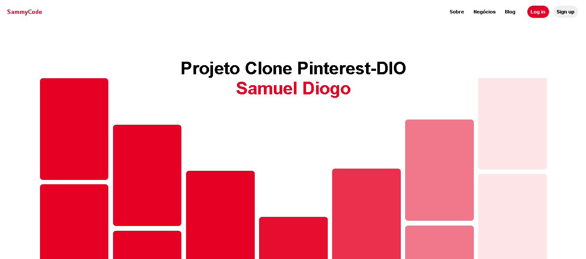

<h1 align="center">
CLONE Homepage Pinterest - Projeto DIO
</h1>

recriando o layout da homepage do Pinterest com HTML, Sass e JavaScript!

<h1 align="center">
Projeto DIO - Pinterest (Homepage)
</h1>

<a href="https://br.pinterest.com/"> Homepage</a> for study purposes.

[Sammynauta](https://github.com/Sammynauta)

## Resources

- [x] HTML, SCSS e JAVASCRIPT.
- [x] SVG Images.

## Start Dev Environment for VSCode
- Open project folder in VSCode
- Install Live Server and Live Sass Compiler extension
- Right click index.html > Open with Live Server
